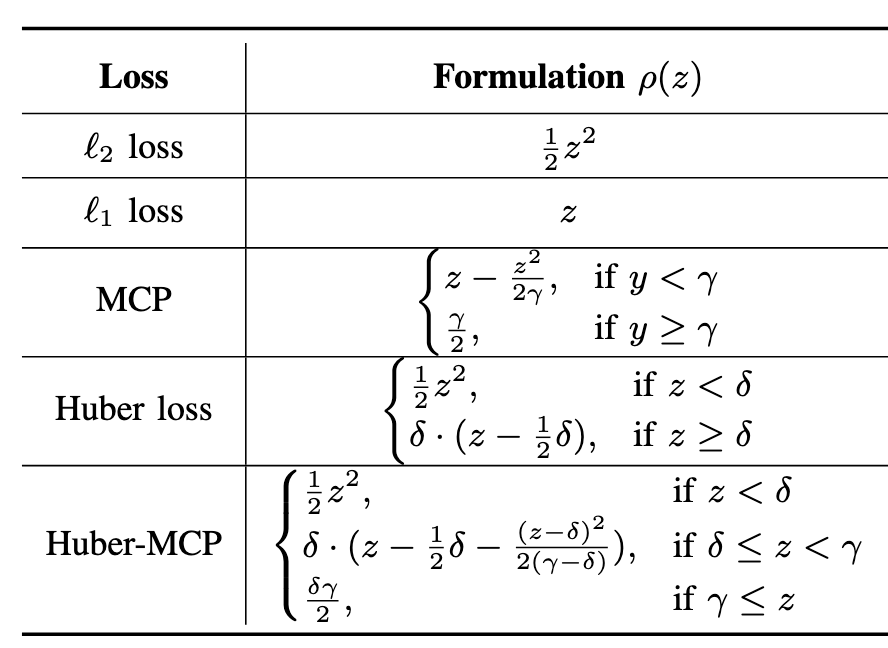

# Efficient Safeguarding of Large-Scale Models


This repository provides the code, data, and results for the paper: Efficient Safeguarding of Large-Scale Models

<p float="left">
  
</p>


## Requirements

This project is built upon [Python 3.10](https://www.python.org).


## Datasets
This section introduces how to obtain the CIFAR-10, Behaviors, RealtimeQA (RQA), and Natural Questions (NQ) datasets.

### CIFAR-10

The CIFAR-10 dataset can be accessed through common deep learning libraries such as PyTorch or TensorFlow:

- **Using PyTorch**:
  ```python
  from torchvision import datasets

  trainset = datasets.CIFAR10(root='./data', train=True, download=True)
  testset = datasets.CIFAR10(root='./data', train=False, download=True)

### Behaviors
It can be obtained from the following GitHub repository:

https://github.com/llm-attacks/llm-attacks/blob/main/data/advbench/

### RealtimeQA (RQA), and Natural Questions (NQ)

Both RealtimeQA (RQA) and Natural Questions (NQ) are referenced in the following paper:

Xiang, C., Wu, T., Zhong, Z., Wagner, D., Chen, D., & Mittal, P. (2024).
Certifiably Robust RAG against Retrieval Corruption.
ArXiv:2405.15556

They can be accessed as follows:

RealtimeQA (RQA):
https://huggingface.co/datasets/RealtimeQA

Natural Questions (NQ):
https://ai.google.com/research/NaturalQuestions


## Reproducing Results

### Visual Recognition
```bash
for norm in L2 L1 Huber MCP
do
    for attack in fgsm pgd
    do
        for model in vit swin beit convit
        do
            CUDA_VISIBLE_DEVICES=1 python main.py --model $model --norm $norm --gamma 4.0 --delta 9.0 --epsilon 1e-2 --L 3 --batch_size 8 --attack $attack &
        done
    done
done
```


## Experimental Results


<p float="left">
  
  <!--   -->
</p>

## Contact

If you have any questions, feel free to contact:

Zhichao Hou: zhou4@ncsu.edu

Tingxiang Ji: tji2@ncsu.edu

Nikhilesh Cherukuri: ncheruk2@ncsu.edu


