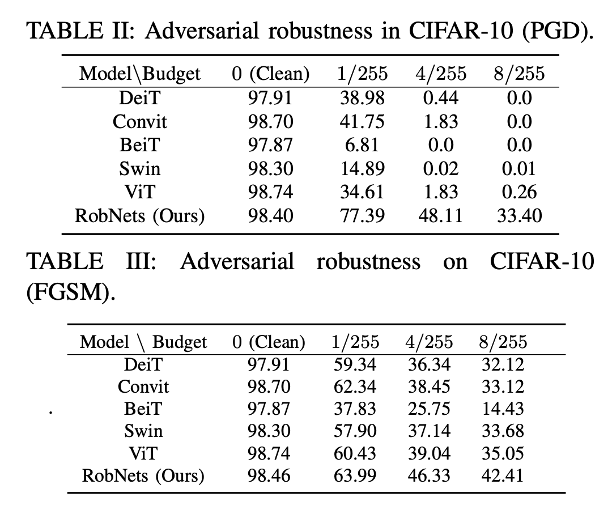

# Efficient Safeguarding of Large-Scale Models


This repository provides the code, data, and results for the paper: Efficient Safeguarding of Large-Scale Models

<p float="left">
  
</p>


## Requirements

This project is built upon [Python 3.10](https://www.python.org).


## Reproducing Results

### Visual Recognition
```bash
for norm in L2 L1 Huber MCP
do
    for attack in fgsm pgd
    do
        for model in vit swin beit convit
        do
            CUDA_VISIBLE_DEVICES=1 python main.py --model $model --norm $norm --gamma 4.0 --delta 9.0 --epsilon 1e-2 --L 3 --batch_size 8 --attack $attack &
        done
    done
done
```


## Experimental Results


<p float="left">
  
  <!--   -->
</p>

## Contact

If you have any questions, feel free to contact:

Zhichao Hou: zhou4@ncsu.edu

Tingxiang Ji: tji2@ncsu.edu

Nikhilesh Cherukuri: ncheruk2@ncsu.edu


